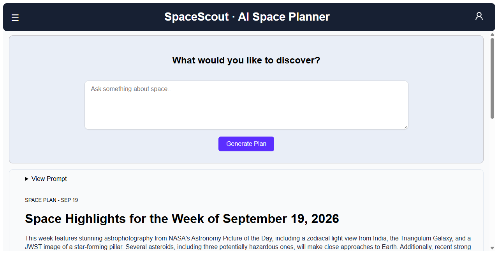
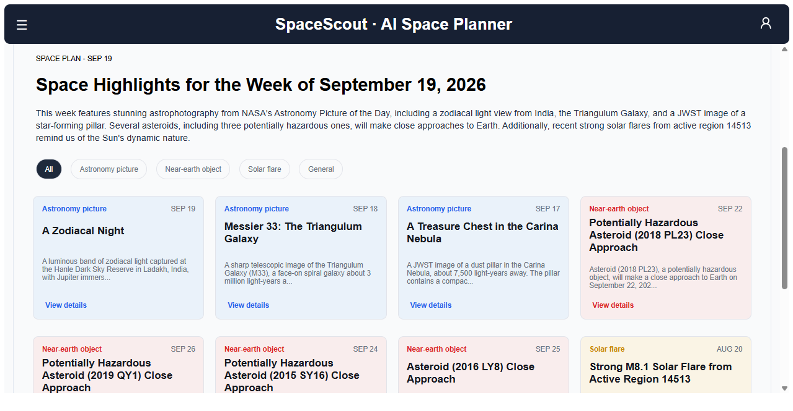
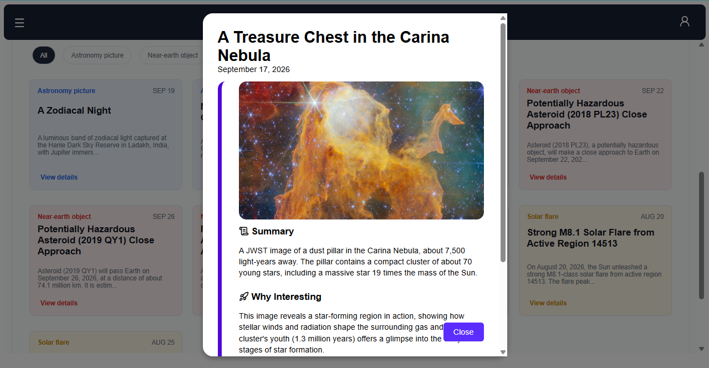

# SpaceScout - AI Space Planner

SpaceScout is a web application that lets users explore space-related information through natural-language requests.

Instead of requiring users to know which NASA API to use or how to structure a query, the SpaceScout application uses an AI model to interpret the request, determine what information is needed, retrieve relevant NASA data, and organize the results into a structured Space Plan.

Users can:

* Ask natural-language questions about space
* Discover NASA information and media
* View structured discovery cards
* Save generated Space Plans
* Revisit previous plans
* View the original prompt used for a plan
* Delete saved plans
* Manage their account through authentication

The application uses a React frontend and Django REST backend with database persistence and JWT authentication.

## Why did i built this?
I built SpaceScout because I found that exploring NASA's APIs can be a bit overwhelming. There are different APIs for different kinds of space data, and figuring out which one to use for a particular question isn't always straightforward. So I wanted to build something that could take a simple question, figure out what information is relevant, and bring the results together in one place.

---

# Distinctiveness and Complexity

SpaceScout is distinct from the other CS50W projects because it is neither a social network nor an e-commerce application. Its main purpose is to provide an AI-assisted interface for exploring external scientific data.

The central workflow is more complex than a basic CRUD application:

1. The user submits a natural-language request.
2. Django receives the request.
3. The AI planner interprets the request.
4. The planner determines which NASA data is relevant.
5. The appropriate NASA APIs are called.
6. The returned information is organized into structured data.
7. Pydantic validates the structured result.
8. The Space Plan is saved to the Django database.
9. React retrieves and displays the resulting discoveries.

The application integrates several independent systems, including Django, a relational database, JWT authentication, an AI model, Pydantic validation, multiple NASA APIs, and a React/TypeScript frontend.

The backend also implements user-specific data access. Saved Space Plans belong to individual users, and backend authorization prevents users from retrieving or deleting plans belonging to another account.

This makes SpaceScout substantially different from applications primarily focused on posts, messages, listings, bidding, or other traditional CRUD workflows.

---

# Project Screenshots
**Home Page**


**Discoveries**


**Discovery Expanded Example**


## Features

### Authentication

* User registration
* User login
* JWT authentication
* Access-token refresh
* Protected routes
* User-specific Space Plan history

### AI Planning

* Natural-language prompts
* AI-assisted planning
* Structured planner output
* Pydantic validation
* General and space-related question handling

### NASA Integration

The application can retrieve information from multiple NASA services:

* NASA Astronomy Picture of the Day (APOD)
* NASA Near Earth Object Web Service (NeoWs)
* NASA DONKI
* NASA media associated with discoveries

### Space Plans

* Generate a structured Space Plan
* Save plans to the database
* View previous plans
* View the original prompt
* Delete plans
* Interactive discovery cards
* Expand discovery details

### User Interface

* React and TypeScript
* Responsive layout
* Mobile-friendly navigation
* Toggleable history sidebar
* Loading states
* Error states
* AI processing/status feedback
* Responsive discovery cards

---

## Technologies Used

### Backend

* Python
* Django
* Django REST Framework
* Django ORM
* Simple JWT
* Pydantic

### Frontend

* React
* TypeScript
* Axios
* React Router
* CSS

### External Services

* OpenRouter
* NASA APIs

---

### Important Backend Files

**`backend/manage.py`**
Django's command-line entry point. It is used for running the development server, migrations, and other Django commands.

**`backend/api/engine/space_planner.py`**
Contains the main Space Planner logic. It processes the user's request, interacts with the configured AI provider, determines the required NASA information, and produces the structured planner result.

**`backend/api/models.py`**
Contains the Django database models, including users, Space Plans, and discoveries.

**`backend/api/serializers.py`**
Contains Django REST Framework serializers for converting database objects to API responses.

**`backend/api/views.py`**
Contains the API views responsible for authentication and Space Plan operations.

**`backend/api/urls.py`**
Defines the backend API routes.

**`backend/api/migrations/`**
Contains Django database migrations.

**`backend/requirements.txt`**
Contains the Python packages required by the backend.

### Important Frontend Directories

**`frontend/src/api/`**
Contains Axios configuration and functions used to communicate with the Django API.

**`frontend/src/components/`**
Contains reusable React components such as the navigation bar, history sidebar, prompt interface, and discovery cards.

**`frontend/src/context/`**
Contains shared React state such as authentication state.

**`frontend/src/pages/`**
Contains the application's major pages.

**`frontend/src/styles/`**
Contains the application's CSS.

**`frontend/src/types/`**
Contains TypeScript definitions for backend data structures.

**`frontend/src/App.tsx`**
Defines the main React application and routing structure.

**`frontend/src/main.tsx`**
Entry point for the React application.

**`frontend/package.json`**
Contains frontend dependencies and development scripts.

---

# Complete Setup

## Requirements
* Python 3
* Node.js and npm
* Git
* A NASA API key
* An OpenRouter API key

---

# 1. Clone the Repository

```bash
git clone https://github.com/Tamercan1/spacescout-ai-space-planner.git
cd spacescout-ai-space-planner
```

---

# 2. NASA API Setup

The project uses NASA APIs to retrieve space-related information.

NASA provides an API key through its API portal.

### Get a NASA API Key

1. Go to the NASA API portal:
   https://api.nasa.gov/
2. Enter your name and email address.
3. Request an API key.
4. Copy the generated API key.

NASA also provides a `DEMO_KEY`, but using your own key is recommended for normal development because the demo key has lower usage limits.

Add your key to your backend environment file.

Example:

```env
NASA_API_KEY=your_nasa_api_key
```

#### More of the .env at `4. Environment Variables`

---

# 3. OpenRouter Setup

The project uses OpenRouter to access the configured AI model.

### Get an OpenRouter API Key

1. Create an account at:
   https://openrouter.ai/
2. Open your account's API key section.
3. Create a new API key.
4. Copy the key.

Add it to your backend environment file.

Example:

```env
OPENROUTER_API_KEY=your_openrouter_api_key
```

Optionally, you will also want to configure the AI model/provider

For example:

```env
# This is optional - default is openrouter/free for free models
LLM_MODEL=your_model_name (optional) - default is openrouter/free for free models
```

Use the model name supported by your current OpenRouter configuration.

---

# 4. Environment Variables

Create a `.env` file inside the backend directory.

Provide:

```env

# NASA
NASA_API_KEY=your_nasa_api_key

# AI Provider
OPENROUTER_API_KEY=your_openrouter_api_key

# This is optional - default is openrouter/free for free models
LLM_MODEL=your_model_name 
```

---

# 5. Backend Setup

Open a terminal:

```bash
cd backend
```

Create a virtual environment:

```bash
python -m venv venv
```

### Windows

```bash
venv\Scripts\activate
```

### macOS/Linux

```bash
source venv/bin/activate
```

Install the required Python packages:

```bash
pip install -r requirements.txt
```

Run Django migrations:

```bash
python manage.py migrate
```

Start the backend:

```bash
python manage.py runserver
```

The Django development server will normally run at:

```text
http://127.0.0.1:8000/
```

Keep this terminal running.

---

# 6. Frontend Setup

Open another terminal and go to the frontend:

```bash
cd frontend
```

Install the JavaScript dependencies:

```bash
npm install
```

Start the development server:

```bash
npm run dev
```

The terminal will display the local frontend URL, normally something similar to:

```text
http://localhost:5173/
```

Paste that in your browser.

Both the Django backend and React frontend must be running.

---

# 7. Create an Account

After opening the frontend:

1. Register a new account.
2. Log in.
3. Enter a natural-language space request.
4. Submit the request.
5. Wait for the AI planner and NASA APIs to process the request.
6. Explore the generated discoveries.
7. Open the history sidebar to revisit previous plans.

---

# Example Prompts

You can try prompts such as:

```text
Show me interesting astronomy events from this week.
```

```text
What asteroids are currently passing relatively close to Earth?
```

```text
Tell me about an interesting NASA image from today.
```

```text
What solar activity has NASA recently recorded?
```

The AI planner determines whether the request requires NASA data and which available NASA services are relevant.

---

# Additional Information

The project uses Pydantic to validate structured information produced by the AI planning layer before it is used by the application.

The database stores generated Space Plans so users can return to previously generated results instead of generating everything again.

The current version represents the **CS50W MVP (v1)**. Future development may include deployment, additional NASA services, performance improvements, and additional planner capabilities.

This project was created as the final project for **CS50's Web Programming with Python and JavaScript (CS50W)**.
